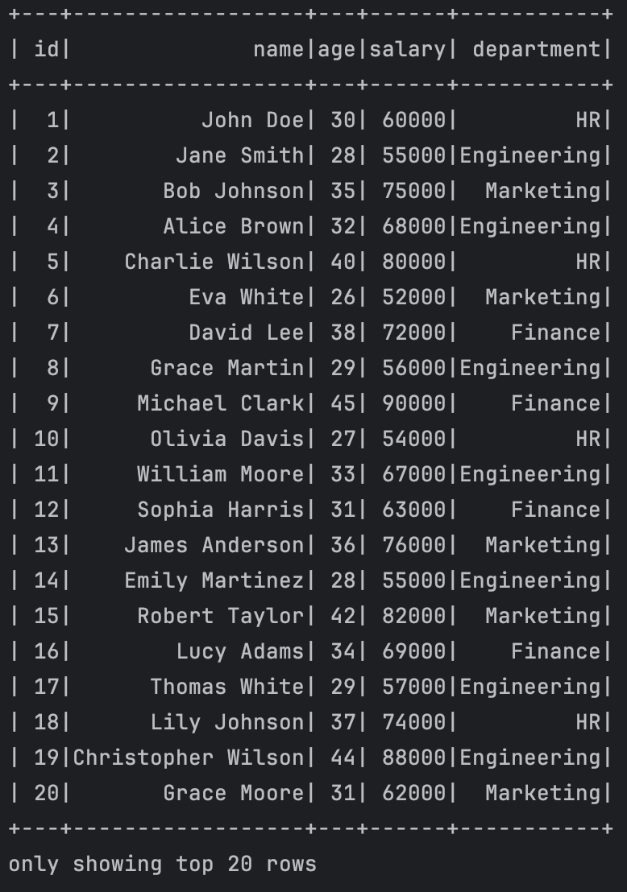

## Week 10 Mini-project

> © Yadong (Hugo) Hu 2023
> 
> This project was generated by this [Awesome Template](https://github.com/0HugoHu/IDS706-Python-Template)

<br />

**Use PySpark to perform data processing on a large dataset.**


## Project Description
This project uses PySpark to perform data processing on the salary dataset. This dataset contains 100 records and 5 columns: id, name, age, salary, department.


## Usage

```bash
# Activate the virtual environment
make virtualenv
source .venv/bin/activate

# Run the program
make run
```

## Result
The result shows the average salary for all departments.

It also shows the average salary for each department using the ```groupBy``` feature.




## Run

### Some Makefile Commands
```commandline
make clean
make install
make format
make lint
make test
make run
```
